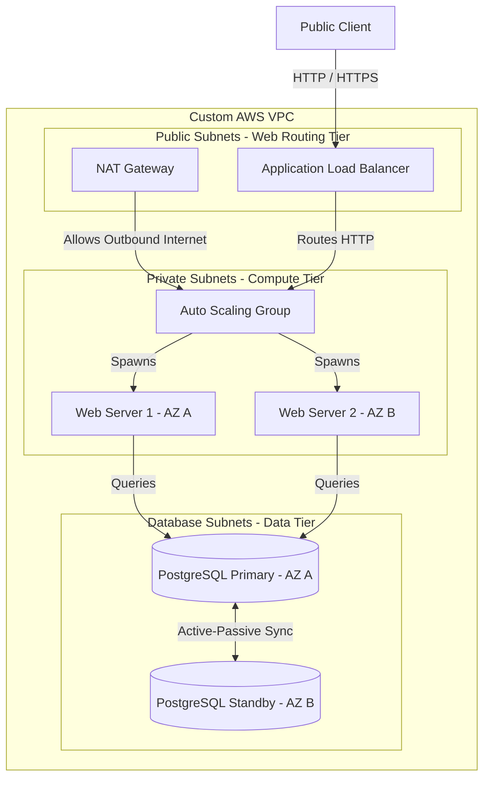

# Highly Available Three-Tier Web Architecture with Terraform on AWS

[](https://github.com/your-github-username/devops-portfolio-project-1/actions)
[](https://opensource.org/licenses/MIT)
[](https://aws.amazon.com/)
[](https://www.terraform.io/)

This repository implements a **Highly Available (HA), Scalable, and Secure Three-Tier Web Architecture** on AWS using Terraform. It showcases cloud-native architecture best practices, strict network isolation, firewall cascading, and zero-downtime database failover capabilities.

---

## 🏗️ Architecture Layout

This design utilizes three separate subnet layers (Public, Private, and Database) distributed across multiple Availability Zones (AZs) for resilience.



---

## 🌟 Key Cloud Engineering Highlights

*   **Three-Tier Networking VPC:** Fully segregated public, private, and database subnets across 2 Availability Zones. Access between layers is governed strictly by subnets and routes.
*   **Security Group Cascading (Least Privilege):**
    1.  The **ALB Security Group** permits public traffic on HTTP (80) and HTTPS (443).
    2.  The **EC2 Security Group** permits ingress traffic *only* from the ALB Security Group.
    3.  The **RDS Security Group** permits database connections (5432) *only* from the EC2 Security Group.
*   **Auto-Scaling Compute Tier:** Configured an Auto Scaling Group (ASG) with a minimum of 2 instances running across private subnets, automatically scaling up to 4 instances during traffic spikes.
*   **Zero-Downtime Database (Multi-AZ):** Deployed a multi-AZ Amazon RDS PostgreSQL instance. AWS automatically replicates writes to a standby node in a different AZ, initiating automated failover within seconds if the primary node goes down.
*   **Automated Server Bootstrap (IMDSv2):** Utilizes EC2 Launch Templates to bootstrap Apache web servers on boot, dynamically fetching host metadata (Instance ID, AZ, local IP) using **Instance Metadata Service v2 (IMDSv2)**.

---

## 🚀 Deployment Guide

### Prerequisites
*   An active AWS Account.
*   AWS CLI installed and configured (`aws configure`).
*   Terraform installed (`>= 1.5.0`).

### 1. Initialize and Validate Code
Clone the repository and navigate to the `terraform/` directory:
```bash
cd terraform
terraform init
terraform validate
```

### 2. Run the Plan and Apply
Review the resources that will be provisioned by Terraform:
```bash
terraform plan -out=tfplan
```
Once reviewed, apply the plan to build the infrastructure in AWS:
```bash
terraform apply tfplan
```
*Note: RDS database provisioning may take 5–10 minutes to initialize and replicate across AZs.*

### 3. Verify Deployment
Terraform will output the ALB public DNS address at the end:
```bash
# Example Output
alb_dns_name = "ha-web-app-alb-123456789.us-east-1.elb.amazonaws.com"
```
1.  Copy the `alb_dns_name` URL.
2.  Open it in a web browser.
3.  Refresh the page several times—you will see the requests round-robin between the web servers in different Availability Zones (e.g., `us-east-1a` and `us-east-1b`), demonstrating the active load balancing.

---

## 🧹 Teardown
To destroy all provisioned AWS resources and avoid billing charges:
```bash
terraform destroy -auto-approve
```
