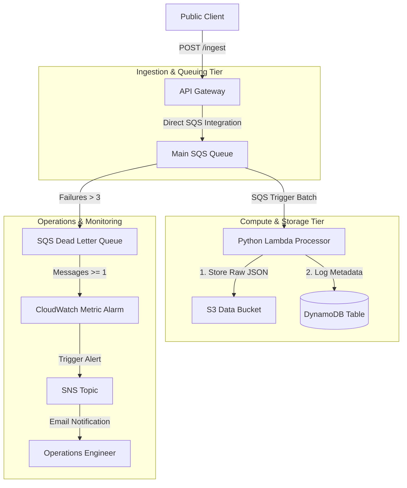

# Event-Driven Serverless Data Processing Pipeline

[](https://github.com/your-github-username/devops-portfolio-project-2/actions)
[](https://opensource.org/licenses/MIT)
[](https://aws.amazon.com/)
[](https://www.terraform.io/)
[](https://www.python.org/)

This repository implements a **Highly Resilient, Cost-Effective, and Event-Driven Serverless Data Pipeline** on AWS using Terraform. It showcases cloud-native architecture best practices, asynchronous load smoothing, zero-compute ingestion, partial batch failure handling, and automated deadlock alerting.

---

## 🏗️ Architecture Layout

This design utilizes decoupled serverless services to ingest, queue, process, index, and archive payloads asynchronously.



---

## 🌟 Key Cloud Engineering Highlights

*   **Zero-Compute API Ingestion:** Configured API Gateway to write client POST payloads directly into SQS using an IAM integration role. This **bypasses any Lambda execution layers during ingestion**, reducing API latency to milliseconds and eliminating cold-start costs.
*   **Asynchronous Load Smoothing:** SQS acts as a buffer. Even if traffic spikes to millions of requests, SQS holds the messages and feeds them to Lambda at a controlled rate, preventing database lockouts.
*   **Dead Letter Queue (DLQ) & Alerting:** Configured a DLQ with a redrive limit of 3. If a payload fails to process due to corruption, it is quarantined in the DLQ. A CloudWatch Metric Alarm triggers immediately and fires an SNS email alert.
*   **Partial Batch Failure Reports:** The Lambda is configured to report specific failed message IDs back to SQS (`batchItemFailures`). If a batch of 10 contains 1 bad payload, **only the bad payload is retried/quarantined**, while the other 9 are successfully processed and cleared.
*   **NoSQL Indexing & Object Storage:** Processes JSON payloads, writes an audit record (Message ID, timestamp, S3 URI, status) to a DynamoDB table, and archives the full payload as a cold JSON file in S3.

---

## 🚀 Deployment Guide

### Prerequisites
*   An active AWS Account.
*   AWS CLI installed and configured (`aws configure`).
*   Terraform installed (`>= 1.5.0`).

### 1. Initialize and Validate Code
Clone the repository and navigate to the `terraform/` directory:
```bash
cd terraform
terraform init
terraform validate
```

### 2. Deploy to AWS
Apply the configuration to provision the pipeline:
```bash
terraform apply -auto-approve
```
*Note: Make sure to override the `alert_email` variable (either via `-var="alert_email=your-email@example.com"` or in a `terraform.tfvars` file) to receive actual alarm emails. AWS will send a confirmation email; click **Confirm Subscription** in the email.*

---

## 🧪 How to Test and Verify

### 1. Trigger the Pipeline (Send Good Message)
Upon successful run, Terraform outputs the API Gateway invoke URL:
```bash
# Example Output
api_url = "https://a1b2c3d4.execute-api.us-east-1.amazonaws.com/prod/ingest"
```
Send a valid JSON payload using `curl`:
```bash
curl -X POST -H "Content-Type: application/json" \
  -d '{"user_id": "usr_99", "action": "purchase", "amount": 49.99}' \
  <YOUR_API_URL>
```
**Expected Response:**
```json
{"status": "SUCCESS", "message": "Message queued successfully", "messageId": "a8b7c6..."}
```

### 2. Verify Output Storage
*   **S3 Bucket:** Check your S3 bucket under the `processed/` directory. You will find a file named `<message_id>.json` containing your posted payload.
*   **DynamoDB Table:** Open the DynamoDB table `serverless-pipeline-metadata` in your AWS Console. You will see an index entry displaying the message ID, processing timestamp, status (`PROCESSED`), and the file S3 URI.

### 3. Simulate DLQ Failure & Alerting
To test the Dead Letter Queue and CloudWatch alerts, send a malformed payload (invalid JSON) that our Lambda code cannot parse:
```bash
curl -X POST -H "Content-Type: application/json" \
  -d '{malformed-json-payload}' \
  <YOUR_API_URL>
```
**What happens next:**
1.  API Gateway will queue the request.
2.  The Lambda tries to process it, fails the JSON parsing, and throws an exception.
3.  SQS will retry the message 3 times.
4.  After the 3rd failure, SQS routes the message to the **DLQ**.
5.  CloudWatch detects a message visible in the DLQ and triggers the Alarm.
6.  SNS fires an alert email to your subscribed email address!

---

## 🧹 Teardown
To destroy all provisioned AWS resources and avoid billing charges:
```bash
terraform destroy -auto-approve
```
