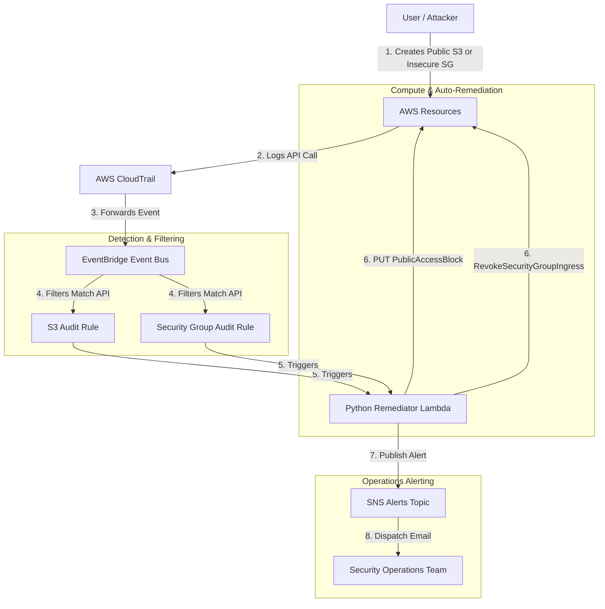

# Cloud Security, Compliance & Auto-Remediator

[](https://github.com/your-github-username/devops-portfolio-project-3/actions)
[](https://opensource.org/licenses/MIT)
[](https://aws.amazon.com/)
[](https://www.terraform.io/)
[](https://www.python.org/)

This repository implements an **Event-Driven Cloud Security Remediator** on AWS using Terraform and Python. It showcases DevSecOps best practices, real-time posture management (CSPM), automated incident remediation, and closed-loop alerting.

---

## 🏗️ Architecture Layout

The system intercepts API calls recorded in CloudTrail in real-time, filters them using EventBridge rules, and triggers a Python Lambda function to instantly revert security policy violations.



---

## 🌟 Key DevSecOps Highlights

*   **Real-Time Active Posture Management:** Traditional security audits run periodically (e.g. daily or weekly), leaving large windows of vulnerability. This event-driven design **closes security violations in under 5 seconds** from the moment of creation.
*   **Principle of Least Privilege IAM:** The Lambda function runs with a highly restricted role: it has read/write privileges *only* for S3 public access blocks, EC2 security group ingress rules, and SNS publishing. It cannot terminate instances, access databases, or write other IAM roles.
*   **Targeted Remediation:** The EC2 SG remediator parses specific ingress rules. If a Security Group has multiple legitimate rules (e.g. port 80/443 open) but adds one rule for port 22 open to `0.0.0.0/0`, the Lambda **only revokes the insecure SSH rule**, leaving other rules untouched.
*   **S3 Guardrails Enforcement:** The S3 remediator monitors bucket actions. If a bucket's Public Access Block configuration is deleted or modified to allow public traffic, the Lambda instantly puts a full Public Access Block in place.
*   **Closed-Loop Operations Alerting:** Once a remediation occurs, the Lambda publishes details (violator user, event time, resource ID, action taken) to an SNS topic, notifying the security team via email *after* the risk is already mitigated.

---

## 🚀 Deployment Guide

### Prerequisites
*   An active AWS Account.
*   AWS CLI installed and configured (`aws configure`).
*   Terraform installed (`>= 1.5.0`).
*   **AWS CloudTrail enabled** (required to send API events to EventBridge).

### 1. Initialize and Validate Code
Clone the repository and navigate to the `terraform/` directory:
```bash
cd terraform
terraform init
terraform validate
```

### 2. Deploy to AWS
Apply the configuration to provision the pipeline:
```bash
terraform apply -auto-approve
```
*Note: Make sure to override the `alert_email` variable (either via `-var="alert_email=your-email@example.com"` or in a `terraform.tfvars` file) to receive actual alarm emails. AWS will send a confirmation email; click **Confirm Subscription** in the email.*

---

## 🧪 How to Test and Verify

### 1. Test S3 Auto-Remediation
1. Create a public S3 bucket (or edit an existing one to remove the Public Access Block configuration) in your AWS Console.
2. Within 5 seconds, refresh the S3 bucket page.
3. **Expected Result:** The "Block all public access" configuration will automatically be set back to **Enabled (Locked)**.
4. Check your inbox: you will receive a security alert email detailing the S3 bucket remediation.

### 2. Test Security Group Auto-Remediation
1. Open any EC2 Security Group in your AWS Console.
2. Add an Ingress Rule allowing **SSH (Port 22)** from source **`0.0.0.0/0`** (Anywhere-IPv4) and click Save.
3. Refresh the Security Group page.
4. **Expected Result:** The violating `0.0.0.0/0` ingress rule will disappear from the list.
5. Check your inbox: you will receive an email notification detailing the Security Group ID, the rule revoked, and the actor who created it.

### 3. Check CloudWatch Execution Logs
To inspect how the Lambda function executed:
1. Open **AWS CloudWatch** in your console.
2. Go to **Log Groups** -> `/aws/lambda/security-remediator-function`.
3. View the latest stream to see log statements like:
   `[WARNING] Vulnerability found in Security Group sg-...! Open SSH (0.0.0.0/0) detected. Remediating...`

---

## 🧹 Teardown
To destroy all provisioned AWS resources and avoid billing charges:
```bash
terraform destroy -auto-approve
```
