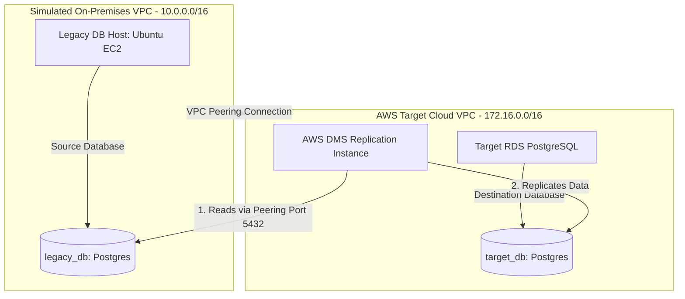

# On-Premises to Cloud Infrastructure Migration Pipeline

[](https://github.com/your-github-username/devops-portfolio-project-4/actions)
[](https://opensource.org/licenses/MIT)
[](https://aws.amazon.com/)
[](https://www.terraform.io/)
[](https://www.postgresql.org/)

This repository implements a **Simulated Enterprise Database Migration Pipeline** on AWS using Terraform. It configures a complete hybrid-cloud networking topology and provisions AWS Database Migration Service (DMS) to execute a live, zero-downtime database migration from a self-managed server (EC2 PostgreSQL) to a managed cloud database (Amazon RDS).

---

## 🏗️ Architecture Layout

This setup uses two distinct VPCs connected via private peering to simulate an on-premise datacenter transferring data privately into the AWS cloud.



---

## 🌟 Key Cloud Migration Highlights

*   **VPC Peering Hybrid Simulation:** Connects the "On-Premises" VPC (`10.0.0.0/16`) and "AWS Cloud" VPC (`172.16.0.0/16`) using VPC Peering and configures cross-VPC route tables, simulating an IPSec VPN or AWS Direct Connect link.
*   **Self-Seeding Legacy Server:** The legacy database host (Ubuntu EC2) automatically installs PostgreSQL during creation, adjusts host listening rules (`pg_hba.conf`) to allow private subnet access, and seeds a mockup database (`legacy_db`) containing employee data.
*   **AWS DMS Managed Replication:** Provisions a DMS replication instance, source/target endpoints, and a migration task.
*   **Full-Load + Change Data Capture (CDC):** Configured the DMS task for `full-load-and-cdc`. This copies the initial records first, and then holds a continuous sync link—replicating updates in real-time, allowing for a **near-zero-downtime cutover**.
*   **Production-Grade IaC Governance:** Complete architecture deployed declaratively via Terraform, and validated by GitHub Actions.

---

## 📋 Database Migration Cutover Playbook (Resume Highlight!)

This playbook outlines the steps required to execute the final cutover from the legacy database to the cloud target.

```
[ Step 1: Trigger DMS ] ➔ [ Step 2: Verify Load ] ➔ [ Step 3: Stop Client Writes ] ➔ [ Step 4: DNS / Endpoint Switch ]
```

### Step 1: Start the Migration Task
In the AWS Console (or via AWS CLI), trigger the replication task to start:
```bash
aws dms start-replication-task --replication-task-arn <DMS_TASK_ARN> --start-replication-task-type start-replication
```

### Step 2: Verify Initial Sync (Full-Load)
Check the database counts on both sides to verify that tables were created and populated.
*   **Source query:** `SELECT COUNT(*) FROM employees;` (Expected: 3)
*   **Target query:** Connect to RDS and check if the `employees` table now exists and has 3 records.

### Step 3: Monitor Live CDC (Replication Status)
DMS is now in continuous sync mode. Any write done on the source EC2 DB will replicate to the RDS database in under 2 seconds.
*   *Test:* Insert a record on the EC2 database:
    `INSERT INTO employees (name, role, hire_date) VALUES ('David Miller', 'SRE Developer', NOW());`
*   *Verify:* Confirm that 'David Miller' immediately appears in the RDS database!

### Step 4: Execute Final Cutover (Zero Data Loss)
1.  **Freeze Source writes:** Stop any application services writing to the legacy EC2 database (put app in read-only mode).
2.  **Wait for Lag to Hit Zero:** In the AWS DMS Console, monitor the metric `CDCLatencySource` and `CDCLatencyTarget`. Wait until both latency metrics drop to `0`, ensuring all cached transactions are applied.
3.  **Redirect Applications:** Change your application connection string from the EC2 private IP (`onprem_db_private_ip`) to the target RDS Endpoint URL (`target_rds_endpoint`).
4.  **Verification:** Make a test write on the application and verify it records directly into RDS.
5.  **Decommission:** Clean up the legacy EC2 instance.

---

## 🚀 Deployment Guide

### Prerequisites
*   An active AWS Account.
*   AWS CLI configured (`aws configure`).
*   Terraform installed (`>= 1.5.0`).

### 1. Initialize and Validate Code
```bash
cd terraform
terraform init
terraform validate
```

### 2. Deploy to AWS
Apply the configuration to provision the pipeline:
```bash
terraform apply -auto-approve
```

---

## 🧹 Teardown
To destroy all provisioned AWS resources and avoid billing charges:
```bash
terraform destroy -auto-approve
```
*Note: Make sure to run this immediately after testing, as DMS instances are billed hourly.*
