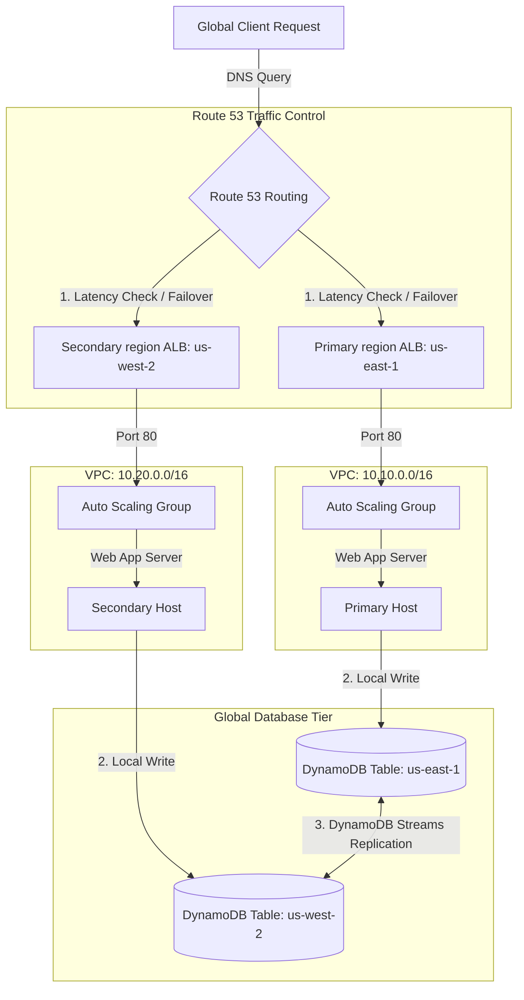

# Global Active-Active Web Application with Multi-Region Failover

[](https://github.com/your-github-username/devops-portfolio-project-5/actions)
[](https://opensource.org/licenses/MIT)
[](https://aws.amazon.com/)
[](https://www.terraform.io/)
[](https://www.python.org/)

This repository implements a **Highly Available, Active-Active Global Web Application** on AWS using Terraform. It provisions redundant application tiers in two distinct AWS regions, configures a DynamoDB Global Table for active-active cross-region data replication, and sets up Route 53 latency-based routing with automated failover health checks.

---

## 🏗️ Architecture Layout

The application directs clients to the region with the lowest latency, syncing page views/writes between regions instantly. If one region suffers an outage, DNS routing shifts traffic to the surviving region.



---

## 🌟 Key Cloud Architecture Highlights

*   **Multi-Region Provider Aliasing:** Declared separate AWS providers (`aws.primary` and `aws.secondary`) to deploy resources in both `us-east-1` and `us-west-2` concurrently.
*   **Active-Active Database Sync:** Deploys a DynamoDB Table with replicas in both regions. By enabling DynamoDB Streams, writes executed locally in either region are replicated globally in **under 1 second**, supporting local active-active writes.
*   **Intelligent Global DNS Routing:** Configures Route 53 Latency Routing. It automatically matches users to the region with the fastest round-trip time.
*   **Automated Regional Failover:** Deploys Route 53 Health Checks monitoring both ALBs. If the Primary ALB fails its checks (e.g. during a regional outage), Route 53 automatically stops sending traffic there and shifts **100% of global traffic** to the Secondary region.
*   **Secure Tier-Isolation:** All application instances run in private subnets and only accept inbound HTTP connections from the Load Balancer security group, preventing direct public exposure.

---

## 🧪 How to Test and Verify

### 1. Access the Regional Load Balancers
Upon running `terraform apply`, the outputs will list the DNS names of both load balancers:
```bash
# Example Outputs
primary_alb_dns = "http://global-app-primary-alb-123456.us-east-1.elb.amazonaws.com"
secondary_alb_dns = "http://global-app-secondary-alb-654321.us-west-2.elb.amazonaws.com"
```
*   Open the **Primary ALB URL** in your browser. You will see a dark card showing:
    `Served from Region: us-east-1` (with a blue title) and a successful DynamoDB write statement.
*   Open the **Secondary ALB URL**. You will see:
    `Served from Region: us-west-2` (with a green title).

### 2. Verify Database Global Replication
1.  Access the Primary ALB URL. A page view record is written to `us-east-1`.
2.  Open your AWS Console and navigate to **DynamoDB** -> **Tables** -> **`global-app-visits`**.
3.  Go to **Explore table items** in either region (`us-east-1` or `us-west-2`).
4.  **Result:** You will find the visit record present in **both** tables! This proves that writes to `us-east-1` are instantly replicated to `us-west-2`.

### 3. Simulate Regional Failover
*(Note: This requires Route 53 domain configuration to test DNS failover)*
1.  Under normal operations, querying `app.<your-domain>.com` will route you to the nearest region.
2.  Simulate a total regional outage by setting the Auto Scaling Group `desired_capacity` in `us-east-1` to `0`.
3.  The Primary ALB health checks will fail.
4.  Querying `app.<your-domain>.com` again will instantly resolve to the **Secondary ALB** (`us-west-2`) instead, keeping your application online.

---

## 🚀 Deployment Guide

### Prerequisites
*   An active AWS Account.
*   AWS CLI configured (`aws configure`).
*   Terraform installed (`>= 1.5.0`).
*   *(Optional)* A registered Route 53 Hosted Zone domain name to test DNS routing.

### 1. Initialize and Validate Code
```bash
cd terraform
terraform init
terraform validate
```

### 2. Deploy to AWS
Apply the configuration to provision the pipeline:
```bash
terraform apply -auto-approve
```
*To override the domain name, run: `-var="domain_name=yourdomain.com"`.*

---

## 🧹 Teardown
To destroy all provisioned AWS resources and avoid billing charges:
```bash
terraform destroy -auto-approve
```
*Note: Make sure to run this immediately after testing, as Multi-Region deployments run double the load balancers and instances.*
