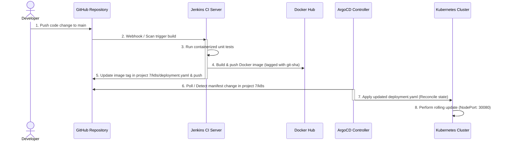

# GitOps Application Delivery Pipeline (Jenkins + Kubernetes + ArgoCD)

This repository implements a **Continuous Delivery (CD) GitOps Pipeline** using Jenkins, Kubernetes, and ArgoCD. It demonstrates separating continuous integration (building and packaging) from continuous deployment (reconciling desired cluster state with Git manifests).

---

## 🏗️ Architecture Layout

The pipeline splits build automation (Jenkins) from deployment automation (ArgoCD) using Git as the single source of truth.



---

## 🌟 Key DevOps Highlights

*   **GitOps Separation of Concerns:** Application logic and Kubernetes manifests reside separately. The cluster state is declared completely in Git under the `project 7/k8s/` folder.
*   **Automated Manifest Templating:** Jenkins uses `sed` to dynamically replace the placeholder tag in `k8s/deployment.yaml` with the short Git commit SHA of the current build.
*   **Write-Back Credentials:** Uses GitHub credentials securely inside Jenkins to push manifest changes back to the origin repository without exposing credentials in logs.
*   **Loop Prevention:** Commits pushed back by Jenkins contain the `[skip ci]` tag to prevent triggering recursive Jenkins build loops.
*   **ArgoCD State Reconciliation:** ArgoCD continually compares the live cluster state against `deployment.yaml` in Git, automatically syncing the application when a change is detected.

---

## 🚀 Setup & Deployment Guide

### Step 1: Configure GitHub Credentials in Jenkins
To allow Jenkins to commit and push updated manifests back to your repository:
1.  Generate a **Personal Access Token (PAT)** on GitHub (under Settings -> Developer Settings -> Personal Access Tokens).
2.  Go to your Jenkins dashboard at `http://localhost:8080`.
3.  Click **Manage Jenkins** -> **Credentials** -> **System** -> **Global credentials**.
4.  Click **Add Credentials**:
    *   **Kind:** Username with password
    *   **Scope:** Global
    *   **Username:** *Your GitHub username*
    *   **Password:** *Your GitHub PAT token*
    *   **ID:** `github-credentials` *(Must match the ID in the Jenkinsfile)*
5.  Click **Create**.

### Step 2: Install ArgoCD inside Kubernetes
Ensure you have a local Kubernetes cluster active (such as Docker Desktop Kubernetes, Minikube, or Kind).

1.  Create the namespaces and deploy ArgoCD:
    ```bash
    kubectl create namespace argocd
    kubectl apply -n argocd -f https://raw.githubusercontent.com/argoproj/argo-cd/stable/manifests/install.yaml
    ```
2.  Port-forward the ArgoCD API server:
    ```bash
    kubectl port-forward svc/argocd-server -n argocd 8081:443
    ```
3.  Access the UI at `https://localhost:8081`. 
4.  Log in as **`admin`**. Retrieve the initial password using:
    ```bash
    kubectl -n argocd get secret argocd-initial-admin-secret -o jsonpath="{.data.password}" | base64 -d
    ```

### Step 3: Configure ArgoCD Application
1.  On the ArgoCD UI, click **New App**.
2.  Set the following configuration values:
    *   **Application Name:** `gitops-flask-app`
    *   **Project Name:** `default`
    *   **Sync Policy:** `Automatic` (Check *Prune Resources* and *Self Heal*)
    *   **Repository URL:** `https://github.com/rj1825/DEVops-Practice-2.git`
    *   **Revision:** `main`
    *   **Path:** `project 7/k8s`
    *   **Cluster URL:** `https://kubernetes.default.svc`
    *   **Namespace:** `default`
3.  Click **Create**.

---

## 🧪 How to Verify the Pipeline

1.  Make a small change to the application logic in **[app.py](file:///C:/Users/Anudeep%20Kuncha/OneDrive/Desktop/Pro/project%207/app/app.py)** (e.g., change the version variable to `"1.0.1"`).
2.  Commit and push the change to your GitHub repository.
3.  Jenkins detects the change, builds the image, pushes it to Docker Hub, and automatically commits a change updating the tag in `k8s/deployment.yaml` back to GitHub.
4.  ArgoCD detects the manifest update on GitHub and performs a **rolling update** in your cluster.
5.  Verify the app is running in your cluster:
    ```bash
    kubectl get pods
    ```
6.  Access your app via NodePort:
    🔗 **[http://localhost:30080](http://localhost:30080)**
